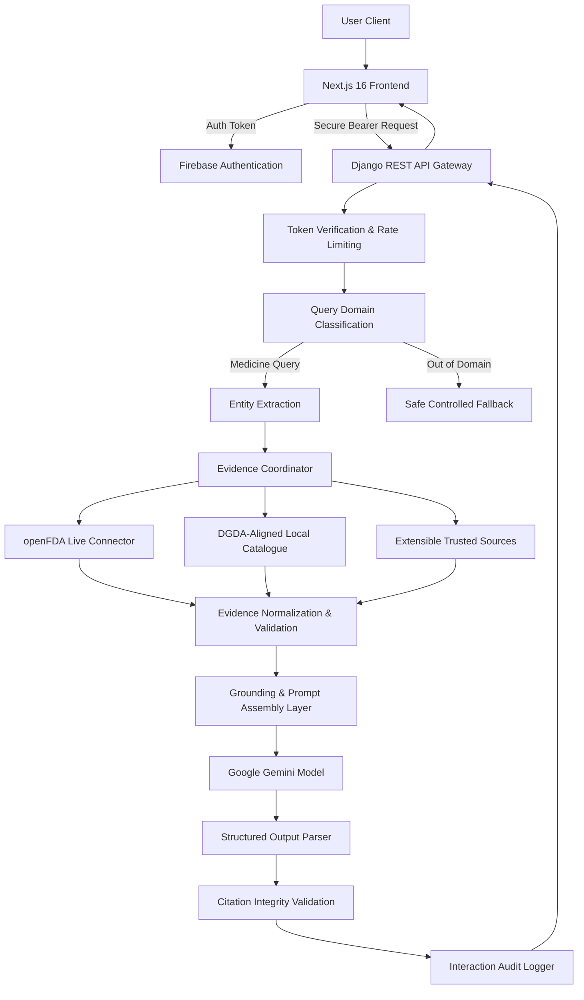

# MediGuard AI

## Evidence-Grounded Medicine Information & Verification Platform

MediGuard AI is an independent full-stack healthcare research and educational software project designed to help users explore medicine information, understand pharmaceutical packaging, and cross-reference records against structured regulatory and catalogue evidence.

> [!IMPORTANT]
> **Academic Research Prototype — Not a Medical Device**  
> MediGuard AI is developed solely for educational, academic, and research demonstration purposes. It is **NOT** a healthcare provider, clinical diagnostic tool, pharmacy, or substitute for licensed medical practitioners, official pharmaceutical regulators, or laboratory testing. Automated outputs may contain errors and must always be independently verified with qualified medical professionals.

Instead of deploying an unconstrained chatbot that blindly forwards medical queries to a Large Language Model (LLM), MediGuard is built on a defensive, multi-tier evidence pipeline engineered for **reducing the risk of unsupported or fabricated outputs**:

```text
Classify Query → Extract Medicine Entities → Retrieve Trusted Evidence → Validate Source Records → Generate Grounded Interpretation → Attach Controlled Citations
```

The system ensures that **evidence precedes generation**, reducing the risk of unsupported model assertions and maintaining strict provenance over all retrieved pharmaceutical data.

---

## Why MediGuard Was Built

MediGuard was inspired by a pressing real-world challenge: **the difficulty ordinary patients face when attempting to verify and understand medicines in regions with fragmented public pharmaceutical records, such as Bangladesh.**

In many developing healthcare environments, patients receiving prescriptions face substantial hurdles:

* **Information Asymmetry**: Patients often cannot readily verify whether a prescribed brand is officially documented, what its active generic compounds are, or who manufactures it.
* **Complex Packaging & Labeling**: Technical terms, lot numbers, and barcode variations can be confusing and intimidating to patients under stress.
* **Verification Gap**: Most patients do not have the technical background or time to navigate fragmented regulatory registries, cross-reference external drug labels, and detect inconsistencies while managing an illness.
* **Risks of Unconstrained AI**: Simply asking generic AI chatbots for medical guidance poses severe risks, including unverified dosage recommendations, hallucinated drug interactions, and fabricated sources.

MediGuard was developed around a fundamental design philosophy:

> **Evidence First. AI Second.**

The platform retrieves structured medicine records from verified sources first, strictly controls and verifies citation links, and only then allows the AI layer to interpret and summarize the validated evidence for the user.

---

## Core Features

### 1. Evidence-Grounded AI Assistant
* **Domain Guardrails**: Incoming queries are classified to ensure they fall strictly within supported medicine verification boundaries before triggering evidence retrieval.
* **Restricted Interpretation Role**: Gemini is constrained to interpret retrieved evidence rather than serving as the primary factual source; generated outputs may nevertheless contain errors.
* **Safety Terms & Conditions Gating**: Users must authenticate and explicitly acknowledge safety notices and liability terms before accessing the assistant. Declining automatically terminates the session and redirects to the homepage.

### 2. Multi-Tier Medicine Data Architecture
* **Live openFDA Drug Label Connector**: Real-time integration with the openFDA Drug Label API for international pharmaceutical evidence, warnings, active ingredients, and indications.
* **DGDA-Aligned Local Catalogue**: A normalized Bangladesh-focused medicine catalogue containing structured medicine, generic, dosage-form, and manufacturer records derived from public pharmaceutical datasets.
* **Extensible Trusted-Source Adapter Pipeline**: Modular architecture designed to incorporate additional regulatory sources without refactoring the AI orchestration core.

### 3. Defensive API & Evidence Validation
* **Strict Source Provenance**: Every piece of retrieved data retains source metadata, retrieval timestamps, official URLs, and listing status.
* **Candidate Match Paradigm**: Database matches are explicitly treated as *candidate records*, never as definitive proof of physical medicine authenticity.
* **Controlled Citation Integrity**: Citation identifiers are minted and validated exclusively by the backend; arbitrary URLs generated by the LLM are stripped.

### 4. Admin Audit Cockpit & Search Telemetry
* **Role-Gated Dashboard** (`/admin`): Restricted exclusively to authorized administrators via server-side Firebase token claims and UID allowlisting.
* **Usage & Query Telemetry**: Tracks user registration milestones and user search queries to analyze real-world medicine queries for academic research.
* **Non-Sale of Data Commitment**: User queries are maintained exclusively for system safety, audit compliance, and research, with zero third-party commercial sale.

### 5. Packaging & Optical Recognition
* **QR & Barcode Scanner**: In-browser scanning for GS1 DataMatrix and standard barcodes to facilitate quick medicine lookup directly from packaging labels.
* **Responsive Modern UI/UX**: Built with Next.js 16, Tailwind CSS, Lucide icons, responsive device mockups, and comprehensive light/dark theme support.

---

## Architecture



---

## Technology Stack

### Frontend
* **Framework**: [Next.js 16](https://nextjs.org/) (App Router, Turbopack)
* **Library**: [React 19](https://react.dev/)
* **Language**: [TypeScript](https://www.typescriptlang.org/)
* **Styling**: [Tailwind CSS 4](https://tailwindcss.com/), Glassmorphism UI
* **Icons**: [Lucide React](https://lucide.dev/)
* **Authentication**: [Firebase Auth Client SDK](https://firebase.google.com/)
* **Scanning**: [Html5-Qrcode](https://github.com/mebjas/html5-qrcode)

### Backend
* **Language**: [Python 3.12](https://www.python.org/)
* **Framework**: [Django](https://www.djangoproject.com/) & [Django REST Framework](https://www.django-rest-framework.org/)
* **Database**: [PostgreSQL](https://www.postgresql.org/)
* **Authentication**: [Firebase Admin SDK](https://firebase.google.com/docs/admin/setup)
* **AI Orchestration**: [Google Gemini 2.5 Flash](https://ai.google.dev/) via HTTPX
* **Data Validation**: [Pydantic v2](https://docs.pydantic.dev/)

---

## Security & Reliability Engineering

* **Server-Side Token Verification**: Every API request is verified against Firebase public keys with `check_revoked=True`.
* **Zero Secrets in Version Control**: All API keys, service accounts, database credentials, and session tokens are strictly managed via environment variables and excluded via `.gitignore`.
* **Defensive Error Handling**: External network timeouts, malformed JSON, truncated bodies, and rate limits fail gracefully without leaking internal stack traces.
* **Controlled Output Contracts**: AI model outputs are enforced using structured JSON schemas and server-side citation integrity checkers.
* **Comprehensive Test Suite**: Over 140+ automated tests covering edge cases, network timeouts, invalid citations, corrupted cache entries, and role authorization.

---

## Project Structure

```text
Mediguard-AI/
├── backend/
│   ├── accounts/              # User profile models, Firebase auth backend, token validation
│   ├── config/                # Django project settings, URL routing, ASGI/WSGI
│   ├── data/                  # DGDA-aligned raw medicine datasets and audit reports
│   ├── medicines/             # Medicine catalog, interactions, views, and test suites
│   │   ├── management/        # CLI management commands (import_catalogue, check_catalogue)
│   │   ├── migrations/        # Database migrations (schema evolution)
│   │   └── services/          # Evidence coordination, openFDA connector, Gemini orchestration
│   └── manage.py
│
├── frontend/
│   ├── public/                # Static brand graphics and device mockup assets
│   ├── src/
│   │   ├── app/               # Next.js App Router (pages: /, /chat, /about, /admin, /login)
│   │   ├── components/        # UI components (TermsDialog, ScannerDemo, Navbar, Footer)
│   │   └── lib/               # Firebase client config, API client, utility functions
│   └── package.json
│
├── .gitignore
└── README.md
```

---

## Running the Project Locally

### Prerequisites
* Python 3.11+
* Node.js 20+ & npm
* PostgreSQL
* Firebase Project (Authentication enabled)
* Google Gemini API Key

### 1. Clone the Repository
```bash
git clone https://github.com/dibyasarothidibya-lang/Mediguard-AI.git
cd Mediguard-AI
```

### 2. Backend Setup
```bash
cd backend
python -m venv .venv

# Windows
.venv\Scripts\activate
# macOS/Linux
source .venv/bin/activate

# Install dependencies
pip install -r requirements.txt

# Run migrations
python manage.py migrate

# (Optional) Seed local medicine catalogue
python manage.py import_catalogue

# Run backend development server
python manage.py runserver
```

### 3. Frontend Setup
In a separate terminal:
```bash
cd frontend
npm install
npm run dev
```

The Next.js web application will be live at `http://localhost:3000`.

### 4. Running Backend Automated Tests
```bash
cd backend
python manage.py test
```

---

## Environment Variables Configuration

Create a `.env` file in `backend/` and `frontend/` (ensure these are never committed):

### Backend (`backend/.env`)
```env
DJANGO_SECRET_KEY=your_django_secret_key
DJANGO_DEBUG=False
ALLOWED_HOSTS=localhost,127.0.0.1
CORS_ALLOWED_ORIGINS=http://localhost:3000

DB_NAME=mediguard_db
DB_USER=postgres
DB_PASSWORD=your_password
DB_HOST=127.0.0.1
DB_PORT=5432

GEMINI_API_KEY=your_gemini_api_key
GEMINI_MODEL=gemini-2.5-flash
GEMINI_TIMEOUT_MS=15000
OPENFDA_API_KEY=your_openfda_api_key
ADMIN_FIREBASE_UIDS=your_firebase_user_uid
```

### Frontend (`frontend/.env.local`)
```env
NEXT_PUBLIC_FIREBASE_API_KEY=your_firebase_api_key
NEXT_PUBLIC_FIREBASE_AUTH_DOMAIN=your_project.firebaseapp.com
NEXT_PUBLIC_FIREBASE_PROJECT_ID=your_project_id
NEXT_PUBLIC_FIREBASE_STORAGE_BUCKET=your_project.firebasestorage.app
NEXT_PUBLIC_FIREBASE_MESSAGING_SENDER_ID=your_sender_id
NEXT_PUBLIC_FIREBASE_APP_ID=your_app_id
NEXT_PUBLIC_API_BASE_URL=http://127.0.0.1:8000
```

---

## Current Project Status

| Milestone / Component | Implementation Status | Verification |
| :--- | :--- | :--- |
| **Core Backend Architecture** | ✅ Complete | Modular Django REST Framework services |
| **Authentication & Token Verification** | ✅ Complete | Firebase Admin SDK + Revoked Token Checking |
| **openFDA Live Evidence Pipeline** | ✅ Complete | HTTPX connector with timeouts & schema checks |
| **DGDA-Aligned Local Catalogue** | ✅ Complete | Normalized Bangladesh-focused medicine catalogue |
| **Grounded AI Interpretation Layer** | ✅ Complete | Gemini 2.5 with controlled citation validation |
| **Admin Cockpit & Audit Telemetry** | ✅ Complete | Role-gated at `/admin` with Firebase UID allowlisting |
| **Safety Terms Agreement Modal** | ✅ Complete | Account authentication + popup terms gating on `/chat` |
| **Comprehensive Legal Notice** | ✅ Complete | Full 25-section disclosure on `/about` |
| **Automated Test Suite** | ✅ Complete | **141/141 passing** backend unit & security tests |
| **Frontend UI/UX Polish** | ✅ Complete | Next.js 16, Turbopack, responsive mockups |

---

## What MediGuard Does NOT Claim

* **No Claim of Authenticity**: A database match or barcode scan cannot physically prove that a pharmaceutical product is genuine, unexpired, correctly stored, or safe for human consumption.
* **No Clinical or Medical Advice**: MediGuard does not provide diagnoses, treatment plans, prescriptions, or clinical recommendations.
* **No Replacement for Professionals**: Software is an informational aid, never a substitute for a licensed pharmacist, medical doctor, or official healthcare agency.

---

## Author & Academic Disclosure

**Dibya Sarothi Simanta**  
*Full-Stack Software Engineering & Healthcare AI Research Prototype*

Designed and built as an independent project exploring evidence-grounded AI architectures, defensive backend engineering, pharmaceutical data provenance, and healthcare transparency.

---

## License & Disclaimer

MediGuard AI is an educational and research software project. Information provided through this system must not be used as the sole basis for clinical decisions, drug substitution, or emergency treatment. Always consult qualified healthcare professionals and official regulatory authorities for health guidance.
