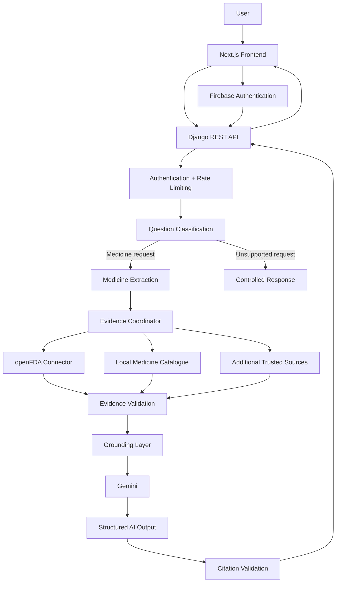

# MediGuard AI
### Evidence-grounded medicine information and verification platform

MediGuard AI is a full-stack healthcare project designed to help users understand medicines, investigate medicine information, and identify potential warning signs when verifying pharmaceutical products.

The project was originally inspired by a real problem: **counterfeit and unreliable medicine information in Bangladesh**.

Instead of building a chatbot that simply sends medical questions to an LLM, MediGuard was designed around a more defensive architecture:

**classify the request → identify medicines → retrieve trusted evidence → validate the evidence → generate a grounded response → attach controlled source references**

The goal is not to replace pharmacists, doctors, regulators, or laboratory verification. MediGuard provides an additional information layer that helps users make better-informed decisions using structured medicine data and trusted regulatory sources.

---

## Why I Built MediGuard

MediGuard began with a personal experience.

During a visit to **Bangladesh’s leading government hospital**, I was prescribed a product that raised serious concerns after I tried to verify it myself. I could not find reliable information about the product through government medicine databases or other trusted pharmaceutical sources commonly used in Bangladesh. It was also being sold at roughly twice the price of several other medicines I had been prescribed.

What concerned me further was the scale of the problem.

Thousands of patients visit this hospital every day from across Bangladesh. Many of them depend on public healthcare because treatment at major private hospitals is financially out of reach. When patients in that position are prescribed products that are difficult to verify, unusually priced, or poorly documented, they may have very little ability to independently determine what they are receiving.

I also noticed another troubling pattern: some of these prescribed products appeared to be available mainly from pharmacies surrounding the hospital and were difficult to find elsewhere in the country.

Because patients travel from every part of Bangladesh to seek treatment at this hospital, problems involving medicine transparency, availability, and verification can potentially affect people far beyond Dhaka.

What disturbed me most was exactly where this happened.

This was not an obscure clinic or an unregulated source. It happened while I was receiving treatment at **the country’s leading government medical institution**, a place that thousands of people trust with their health every single day.

That experience made me realize how difficult it can be for an ordinary patient to independently answer basic questions:

* Is this actually a recognized medicine?
* What is its active ingredient?
* Who manufactures it?
* Is there a regulatory record for it?
* Does the packaging information match trusted pharmaceutical data?
* Where can I independently verify these claims?

Most patients cannot realistically search regulatory databases, compare pharmaceutical datasets, inspect medicine labels, and interpret conflicting information while they are already dealing with illness.

That became the motivation for **MediGuard AI**.

I wanted to build a system that could make trusted medicine information easier to access while avoiding another major problem: simply asking an AI model and trusting whatever it says.

MediGuard therefore developed around a simple principle:

> **Evidence first. AI second.**

The system retrieves available medicine information from trusted sources, preserves where that information originated, validates the evidence, and only then allows the AI layer to help explain it to the user.

MediGuard does not claim that software alone can prove whether a physical medicine is authentic, and it is not a replacement for pharmacists, physicians, regulators, or laboratory testing.

Its purpose is simpler: to give patients a better starting point for questioning, understanding, and independently verifying the medicines they receive.

---

# Core Features

### AI Medicine Assistant

Users can ask medicine-related questions through an AI-powered interface.

Before an answer is generated, the backend first determines whether the request falls within MediGuard’s supported medicine domain. It then identifies relevant medicine names and gathers available evidence from trusted data sources.

Only after that evidence has been collected and validated is it passed to the AI layer for explanation.

The language model is therefore **not treated as the source of truth**. It acts as an interpretation layer on top of retrieved evidence rather than generating unsupported medical information on its own.


### Evidence-Grounded Responses

MediGuard contains a dedicated evidence pipeline that separates:

* medicine-name extraction
* source retrieval
* evidence preparation
* AI generation
* citation validation
* final answer rendering

Retrieved evidence is passed to the model under a strict output contract.

The model cannot freely generate source URLs. Citation identifiers are created and controlled by the backend, and generated citation references are validated before being returned to the user.

---

### openFDA Integration

MediGuard currently supports live medicine-label retrieval through the **openFDA drug-label API**.

The connector includes defensive handling for:

* invalid queries
* API rate limits
* network failures
* malformed API responses
* unexpected response structures
* oversized responses
* request time budgets
* invalid medicine-label records
* caching
* provenance preservation

Returned records are treated as **candidate label matches**, not proof that a user's physical medicine is authentic.

---

### Trusted Source Architecture

The backend contains a structured trusted-source system designed to distinguish where medicine evidence originated.

Sources can carry information such as:

* jurisdiction
* access method
* source identifier
* evidence type
* product name
* ingredient
* strength
* dosage form
* manufacturer
* batch information
* listing status
* official source URL
* source version
* retrieval time
* review information

The architecture currently includes configuration for sources such as:

* openFDA
* Bangladesh DGDA
* DailyMed

openFDA currently has the implemented live lookup connector. Additional regulatory sources can be connected through the same evidence architecture without redesigning the AI pipeline.

---

### Medicine Catalogue Pipeline

MediGuard includes database models for importing and normalizing medicine catalogue data.

Import batches preserve metadata such as:

* dataset version
* original filename
* checksum
* received rows
* accepted rows
* rejected rows
* processing status

Original source rows can also be preserved separately from normalized medicine records.

This allows the system to maintain a distinction between:

**raw source data → normalized catalogue data → regulatory evidence**

instead of treating every dataset as equivalent proof of authenticity.

---

### Firebase Authentication

Authentication is handled using Firebase on the client side and verified again by the Django backend.

The backend:

* extracts bearer tokens
* verifies Firebase ID tokens
* checks revoked tokens
* rejects invalid credentials
* creates corresponding local users transactionally
* prevents authentication failures from being exposed as internal implementation details

Protected endpoints require authenticated users.

---

### API Rate Limiting

The medicine assistant uses server-side throttling to reduce abuse and unnecessary external API/AI usage.

Current chat limits include both short-term and hourly throttles.

---

### QR / Barcode Scanning

The frontend includes browser-based scanning capabilities intended to make medicine lookup and verification easier from product packaging.

Scanning provides a convenient input mechanism; the presence of a barcode or QR code itself is **not considered proof of authenticity**.

---

### Responsive Web Interface

The frontend is built with modern React and Next.js technologies and includes support for responsive layouts and light/dark interface themes.

---

# Architecture


```mermaid
flowchart TD
    U[User] --> F[Next.js Frontend]

    F --> A[Firebase Authentication]
    F --> API[Django REST API]

    A --> API

    API --> AUTH[Authentication + Rate Limiting]
    AUTH --> CLASSIFY[Question Classification]

    CLASSIFY -->|Medicine request| EXTRACT[Medicine Extraction]
    CLASSIFY -->|Unsupported request| SAFE[Controlled Response]

    EXTRACT --> EVIDENCE[Evidence Coordinator]

    EVIDENCE --> OFDA[openFDA Connector]
    EVIDENCE --> CAT[Local Medicine Catalogue]
    EVIDENCE --> FUTURE[Additional Trusted Sources]

    OFDA --> VALIDATE[Evidence Validation]
    CAT --> VALIDATE
    FUTURE --> VALIDATE

    VALIDATE --> GROUND[Grounding Layer]
    GROUND --> AI[Gemini]
    AI --> OUTPUT[Structured AI Output]

    OUTPUT --> CITATION[Citation Validation]
    CITATION --> API
    API --> F
```

A central design principle of MediGuard is that the AI model does **not** control the complete pipeline.

Retrieval, validation, source handling, authentication, throttling, and citation rendering remain backend responsibilities.

---

# Technology Stack

## Frontend

* Next.js
* React
* TypeScript
* Tailwind CSS
* Firebase
* html5-qrcode
* shadcn
* Base UI
* Lucide React

## Backend

* Python
* Django
* Django REST Framework
* PostgreSQL
* Firebase Admin
* Pydantic
* HTTPX
* Google Gemini

## External Data

* openFDA Drug Label API
* local/imported medicine catalogue data
* extensible trusted-source infrastructure

---

# Evidence and Grounding Design

Medicine-related AI systems have an important problem:

A language model can produce a fluent answer even when the underlying information is missing, ambiguous, or incorrect.

MediGuard attempts to reduce this problem by separating **retrieval** from **generation**.

The evidence pipeline records the state of every source check independently.

A source may be:

* completed
* disabled
* not configured
* not implemented
* unsupported for the query
* unavailable
* not checked

This distinction is important.

For example:

**"The source could not be checked" does not mean "the medicine was not found."**

Similarly, finding a medicine label by name does not prove that the physical medicine being held by a user is genuine.

These limitations are carried through the evidence layer so that failures are not silently converted into confident AI claims.

---

# Controlled Citations

MediGuard does not allow the language model to freely invent links.

The backend creates temporary citation identifiers for approved evidence records.

The model can reference only those identifiers.

After generation, the backend checks that:

1. every citation exists,
2. duplicate citation identifiers are rejected,
3. only validated official URLs are rendered,
4. arbitrary URLs generated by the model are not accepted.

This keeps source rendering under application control rather than model control.

---

# Defensive External API Handling

The openFDA integration was built assuming that external systems can fail.

The connector validates:

* input format
* HTTP status codes
* response size
* response time
* JSON structure
* record structure
* UUID-formatted label identifiers
* label dates
* product metadata
* supported label sections

Responses are converted into validated internal evidence objects before they are used elsewhere in the application.

Successful lookups can be cached, while failed or invalid responses are intentionally prevented from contaminating trusted cache entries.

---

# Testing & Reliability

Testing was performed continuously throughout development rather than only after the application was completed.

The backend test suite intentionally exercises both successful behaviour and failure conditions.

Examples include:

* repeated API requests and cache reuse
* cache expiration
* corrupted cache entries
* malformed JSON
* incorrect response types
* HTTP failures
* API rate limiting
* network timeouts
* oversized responses
* missing medicine metadata
* invalid label identifiers
* impossible dates
* unsupported input
* incomplete external records
* provenance preservation
* AI classification failures
* evidence coordination failures
* invalid citation references
* duplicate citations
* malformed structured AI responses
* missing evidence
* authentication edge cases

The project was repeatedly tested from the terminal while features were being implemented, with components deliberately placed into invalid and unexpected states to verify their behaviour.

For healthcare-related software, predictable failure is often more important than a perfect happy-path demonstration.

---

# Data Provenance

MediGuard intentionally distinguishes between several kinds of information.

A medicine appearing in a searchable catalogue does **not** automatically establish:

* regulatory registration
* authenticity
* correct physical packaging
* correct strength
* manufacturing legitimacy
* patient suitability

For this reason, catalogue records and regulatory evidence are represented separately.

Evidence records preserve source metadata and official-source information whenever available.

---

# Security Considerations

MediGuard includes several defensive measures, including:

* environment-based secret configuration
* Firebase server-side token verification
* revoked-token checking
* authenticated API access
* user-based request throttling
* restricted trusted-source hostnames
* HTTPS validation for official evidence URLs
* external response-size limits
* external request time budgets
* strict structured AI output validation
* controlled citation generation

Sensitive environment files, private keys, service-account credentials, and generated build files are excluded from version control.

---

# Project Structure

```text
Mediguard-AI/
│
├── backend/
│   ├── accounts/
│   │   └── Authentication and local user integration
│   │
│   ├── medicines/
│   │   ├── services/
│   │   │   ├── AI orchestration
│   │   │   ├── evidence coordination
│   │   │   ├── grounding and citation validation
│   │   │   └── external medicine-source connectors
│   │   │
│   │   ├── models.py
│   │   ├── serializers.py
│   │   ├── views.py
│   │   └── tests.py
│   │
│   └── config/
│       └── Django configuration
│
├── frontend/
│   ├── src/
│   │   └── app/
│   └── package.json
│
└── README.md
```

---

# Running the Project Locally

## Prerequisites

You will need:

* Python
* Node.js
* PostgreSQL
* Firebase project credentials
* Gemini API credentials
* openFDA API credentials

Clone the repository:

```bash
git clone https://github.com/dibyasarothidibya-lang/Mediguard-AI.git
cd Mediguard-AI
```

### Backend

Create and activate a Python virtual environment.

```bash
cd backend

python -m venv .venv
```

Windows:

```bash
.venv\Scripts\activate
```

Linux/macOS:

```bash
source .venv/bin/activate
```

Configure the required environment variables for Django, PostgreSQL, Gemini, openFDA, and Firebase.

Run database migrations:

```bash
python manage.py migrate
```

Start the Django development server:

```bash
python manage.py runserver
```

### Frontend

From a second terminal:

```bash
cd frontend
npm install
npm run dev
```

The Next.js development server will normally be available at:

```text
http://localhost:3000
```

---

# Environment Configuration

The backend uses environment variables rather than committing secrets to the repository.

Examples of backend configuration include:

```env
DJANGO_SECRET_KEY=
GEMINI_API_KEY=
GEMINI_MODEL=
GEMINI_TIMEOUT_MS=
OPENFDA_API_KEY=

DB_NAME=
DB_USER=
DB_PASSWORD=
DB_HOST=
DB_PORT=
```

Firebase credentials must also be configured for the authentication environment being used.

**Never commit actual credentials, private keys, ****`.env`**** files, or Firebase service-account secrets.**

---

# Running Tests

From the backend directory:

```bash
python manage.py test
```

Testing is a major part of MediGuard's development process. New backend behaviour should ideally include tests for both the expected result and relevant failure conditions.

---

# Screenshots

> Screenshots and final interface previews will be added after the frontend visual polish is complete.

<!--
Recommended final layout:

1. Landing page
2. Medicine assistant
3. Evidence-grounded response
4. QR/barcode scanner
5. Authentication screen
6. Mobile view
-->

---

# What MediGuard Does Not Claim

MediGuard does **not** claim that software alone can conclusively determine whether a physical medicine is genuine.

A database match cannot prove that the packaging in front of a user is authentic.

A label search cannot confirm the exact product without sufficient identifying information.

An AI response cannot replace clinical evaluation.

MediGuard should therefore be treated as an **information and verification-support tool**, not as a substitute for:

* a licensed pharmacist
* a physician
* an official medicine regulator
* laboratory analysis
* emergency medical care

For urgent medical concerns, users should seek appropriate professional or emergency assistance.

---

# Engineering Goals

MediGuard was built around several principles:

**Evidence before generation.**
Where evidence is available, retrieve it before asking the language model to answer.

**Failures must remain failures.**
An unavailable database must not silently become a "no match."

**AI output is untrusted input.**
Model responses are validated before being returned.

**Sources require provenance.**
A piece of medicine information should retain information about where it came from.

**External APIs are unreliable by default.**
Timeouts, malformed responses, rate limits, and unexpected structures must be expected.

**Healthcare requires careful wording.**
Candidate records and AI-generated explanations must not be presented as proof of authenticity or medical diagnosis.

---

# Future Extensibility

The trusted-source system was intentionally designed so that additional medicine regulators and datasets can be integrated without replacing the core evidence pipeline.

Potential source adapters can reuse the same general flow:

```text
External Source
      ↓
Source Connector
      ↓
Validated Evidence Record
      ↓
Evidence Coordinator
      ↓
Grounding Layer
      ↓
Structured AI Response
```

This keeps external data acquisition separate from AI generation.

---

# Project Status

**Core backend architecture: Complete**

**Authentication: Complete**

**Medicine evidence pipeline: Complete**

**openFDA live integration: Complete**

**Grounded AI response system: Complete**

**Backend testing: Complete / continuously expandable**

**Frontend: Functional — final visual polish in progress**

**Documentation: In progress**

---

# Author

**Dibya Sarothi Simanta**

MediGuard AI was designed and developed as an independent full-stack project exploring medicine verification, evidence-grounded AI, healthcare data systems, and defensive backend engineering.

---

## Disclaimer

MediGuard AI is an educational software project.

Information produced by the application should not be used as the sole basis for medical treatment, medication changes, diagnosis, emergency decisions, or determining the authenticity of a physical pharmaceutical product.

Always consult qualified healthcare professionals and relevant regulatory authorities when appropriate.
